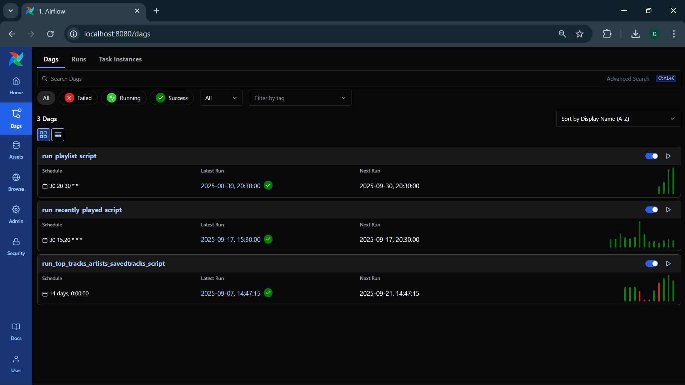

# Spotify ETL Pipeline with Airflow, Docker, PostgreSQL, and Tableau

## Project Overview

In this project, I aim to build a fully functional **ETL (Extract, Transform, Load) pipeline** to collect and analyze my personal Spotify data. The pipeline will extract Spotify data such as **saved playlists, recently played tracks, saved albums, saved tracks, top artists, and top tracks** using the Spotify API.

The extracted data will undergo transformation and will be loaded into a **PostgreSQL** database hosted locally. I will schedule the ETL processes using **Apache Airflow** within a **Docker** container, enabling automated data extraction on a **daily, bi-weekly, and monthly** basis to capture time-specific trends.

Finally, I will build an interactive dashboard in **Tableau** to visualize the insights from my Spotify listening history. This dashboard will serve as a personal version of **Spotify Wrapped**, providing detailed analytics on my listening habits over time.

---

##  Features

* Automated extraction of Spotify data via the Spotify API
* Scheduled ETL workflows using Apache Airflow
* Dockerized environment for easy deployment and scalability
* PostgreSQL database for structured data storage
* Daily, bi-weekly, and monthly data refresh intervals
* Tableau dashboard to visualize listening trends, top artists, and top tracks

---

##  Tech Stack

*  Python
*  Apache Airflow
*  Docker
*  PostgreSQL
*  Spotify API
*  Tableau

---

##  Installation & Setup

### Prerequisites

* Docker & Docker Compose
* PostgreSQL (Local or Dockerized)
* Spotify Developer Account (API credentials)
* Tableau (Desktop or Public)

##  Scheduling Intervals

* **Daily:** Recently played tracks
* **Bi-Weekly:** Saved tracks, saved albums
* **Monthly:** Top artists, top tracks, playlists

---

## Airflow Website

##  Dashboard Example

---

##  Contributing

Contributions are welcome! Please feel free to submit a pull request or open an issue to suggest improvements.

---

### *If you like this project, don't forget to give it a star!*
